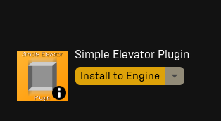

# Downloading plugin

>[!Note]
>Currently supported unreal engine versions:
> - UE 5.0
> - UE 5.1
> - UE 5.2

- Open the Epic Games Launcher and go to the Library tab.
- Search for "Simple Elevator" in the search bar.
- Once you find the plugin, click on the Install button next to it.
- Select the version of Unreal Engine you want to install the plugin for.
- Wait for the installation to complete.

