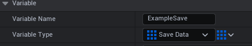
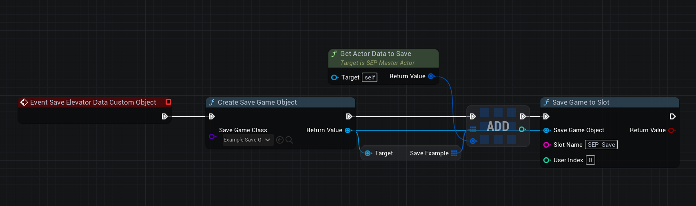
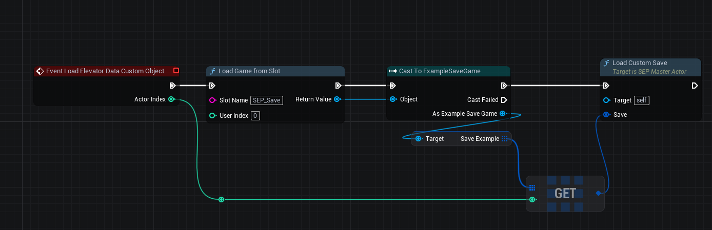

# Integrating SEP Save System into your own one

- Add into already existing save game object new variables with type **Save Data** and change its variable type to array 

- Open BP_SEP_Master_Actor (or its child, if using one) and add ***Event Save Elevator Data Custom Object***.
- Create a new save game object with the selected class and add the current elevator save data to the save data array.
- Save the game to your selected slot.

- To load a save game, use the ***Event Load Elevator Data Custom Object.***
- Cast the loaded game from your slot to your save game object.
- From the save game object, get the save data array and the actor index.
- Call the "Load Custom Save" function on the SEP Master Actor with the save data.
- The plugin will automatically load all necessary settings.

