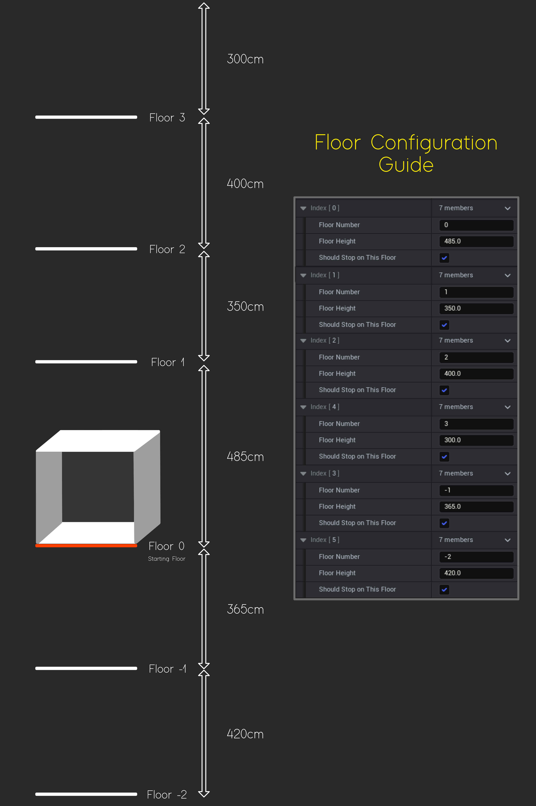

# Floor Configuration

Visual Guide to floor configuration

- **Should Stop On This Floor** - Indicates whether or not the elevator should stop on that floor. It will be ignored if this floor is the target of the elevator's movement.

- **Floor Height** - Specifies the height of a given floor.