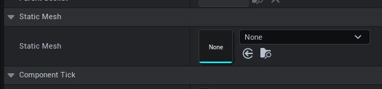
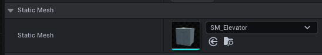

# Using single mesh with Simple Elevator Plugin 2.0

>[!Note]
>When using a single mesh, doors still need to be a separate mesh

>[!Tip]
>BP_SEP_MasterActor_V2 Actor uses single mesh, you can use it as an example.

To use a single mesh as an elevator, you can follow these steps:
- Set the static mesh component to None for the following components: ***Wall SMesh***, ***Wall WMesh***, ***Wall EMesh***, ***Wall NMesh***, ***Roof Mesh***, and **Interaction Panel Mesh**.
- In the Floor Mesh component, set the static mesh as your desired mesh.

