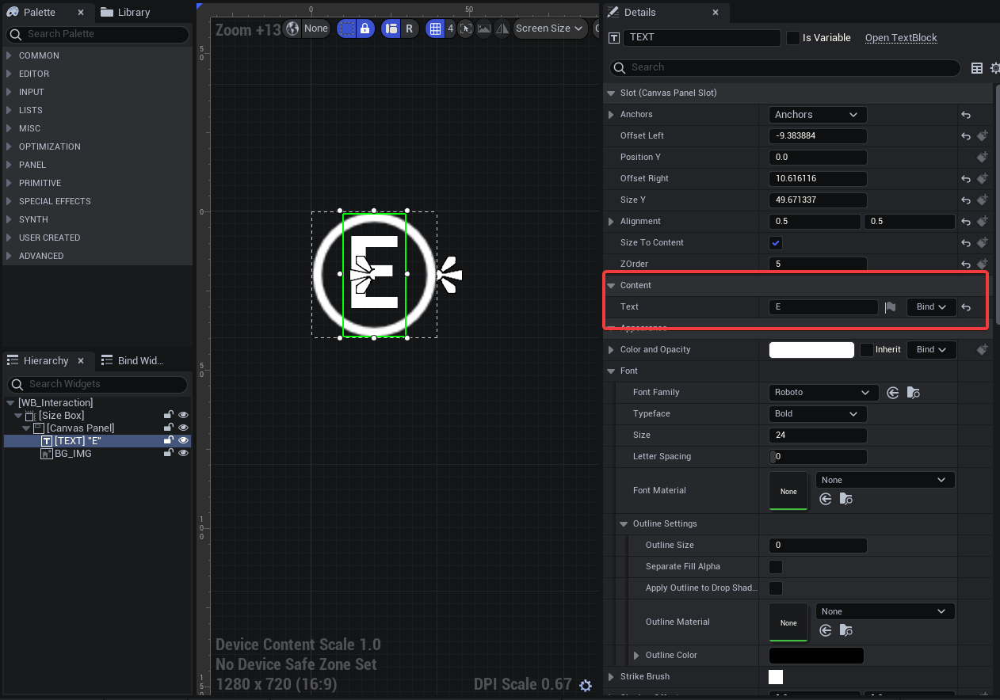
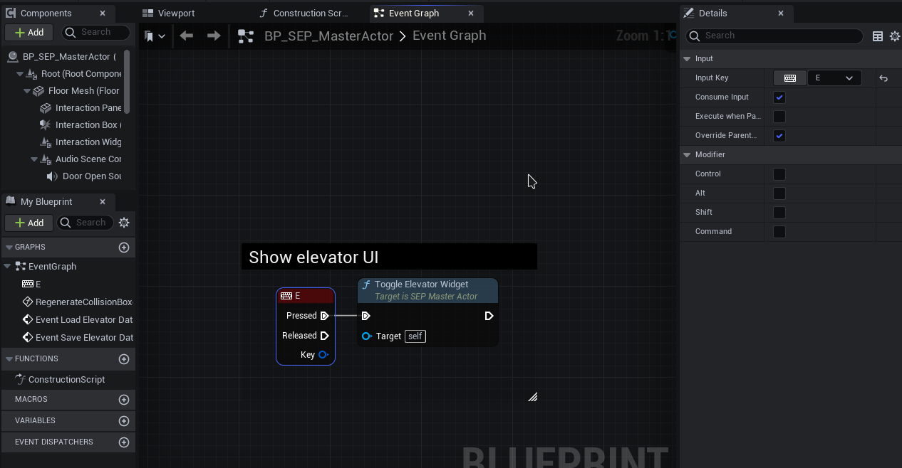
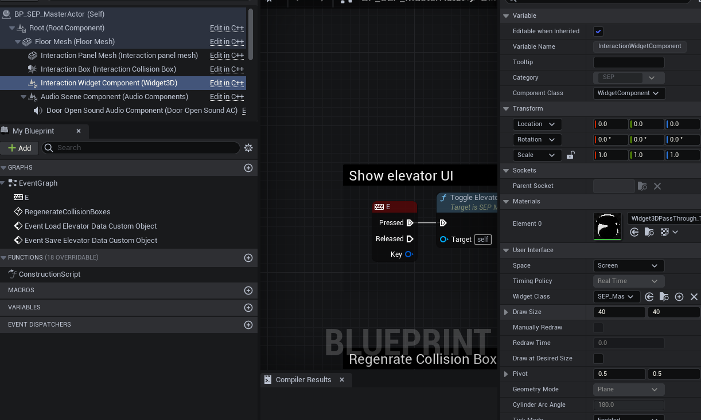

# Interaction Widget

- **Interaction Widget Class** - Determines the class of the 3D Interaction widget. Must be a child of _SEP Master Interaction Widget_ class.

- Customizing widget letter
    - Open WB_Interaction and on the left side select [TEXT] "E" and in details panel on the right side in the text tab you can specify letter you want to use.  
    - Open your elevator actor and find *Toggle Elevator Widget* function, there you can specify the key you want to use to open elevator ui. 

- Customizing widget appearance
    - To set a custom brush image in WB_Interaction:
        - Open WB_Interaction and select BG_IMG on the left side.
        - In the Details panel on the right, locate the Brush Image setting.
        - To set your own image, click the folder icon and select your image file.
        - To resize the image to 64x64, enter "64" in both the Width and Height fields under the Brush Image setting.
    >[!Note]
    >If you want to use larger images than the default one, it may be required to increase the draw size of the 3D widget in your elevator actor, to avoid display issues, although it should still work with the default size.  

# Elevator UI Widget

- **Elevator Widget Class** - Determines the class of elevator UI. Must be a child of _SEP Master Elevator UI_ class.